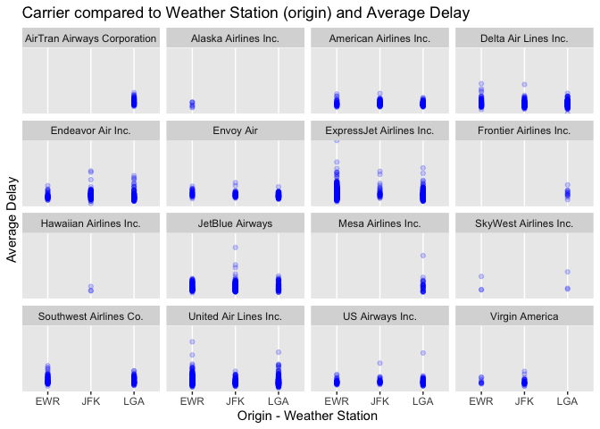
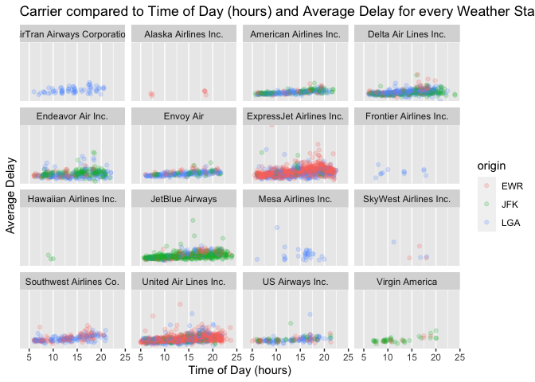
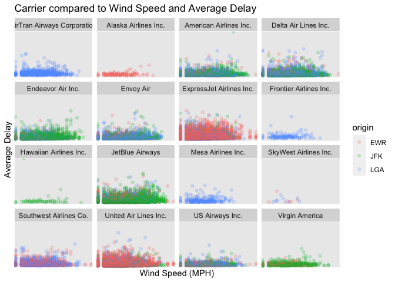
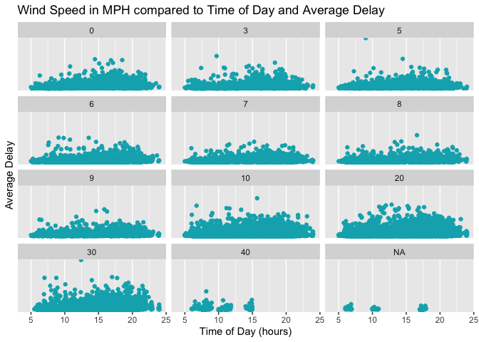
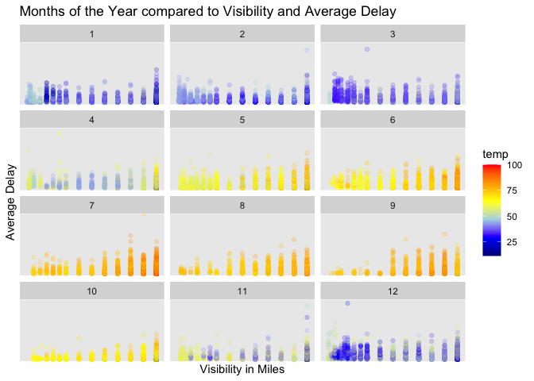
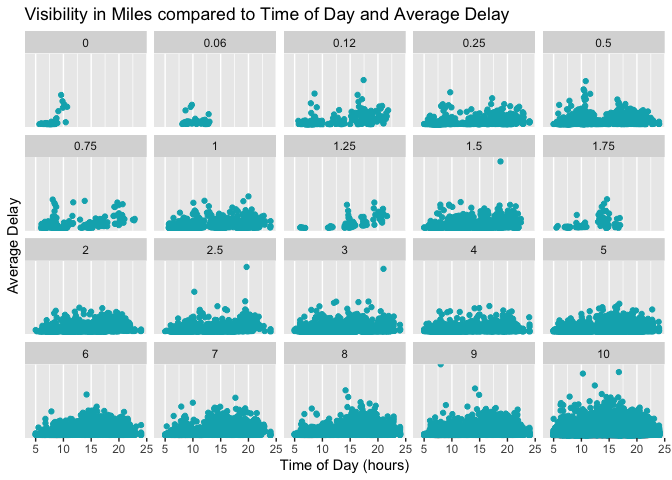

Homework 3 Stat 433
================
Juliana Brandt
2/24/2021

## Exercise

In r4ds flights… What time of day should you fly if you want to avoid
delays as much as possible? Does this choice depend on anything? Season?
Weather? Airport? Airline? Find three patterns (“null results” are
ok\!). Write your results into Rmarkdown. Include a short introduction
that summarizes the three results. Then, have a section for each
finding. Support each finding with data summaries and visualizations.
Include your code when necessary. This shouldn’t be long, but it might
take some time to find the things you want to talk about and lay them
out in an orderly way.

### Introduction

The following data is based on the three datasets, flights, weather, and
airlines, merged into one. From analyzing the data, filtering out
unecessary values, and using only important variables, I was able to
determine three significant patterns. I looked at Carrier and Weather
Stations verus the average flight delay. I then took that information
and added the time of day to see how that would impact the findings.
Next, I looked at Wind Speed compared to the Carrier and how that was
affecting average delay. I then added the time variable once again to
see if time of day affected this. Lastly, I looked at Months of the Year
compared to Visibility and its effect on average delay. I then added the
time of day once more to look at time of day verse these other variable.
All results are below with a description.

## 1\. Carrier, Weather Station (Origin), Average Delay, Time of Day

Looking at the “Carrier compared to Weather Station (origin) and Average
Delay” graph below, we can see ExpressJet Airlines Inc. tends to have
delayed flights much more often than the rest of the airlines. We can
also say the opposite of Southwest Airlines and Virgin America because
they seem to be more on time. Unfortunately we don’t have enough
information to comment on Hawaiian Airlines and SkyWest Airlines.

Next we can see the “Carrier compared to Time of Day (hours) and Average
Delay for every Weather Station (origin)” graph. The interesting part of
this graph is that we can see that no matter the airline, the average
delay increases throughout each day. This can be due to airlines getting
behind schedule as the day progesses.
<!-- --><!-- -->

## 2\. Carrier, Wind Speed, Airline, Average Delay, Time of Day

Now, I am comparing wind speed against the normal variables average
delay and time of day. Looking at the graph below titled “Carrier
compared to Wind Speed and Average Delay”, we can see some trends.There
is a clear relationship with wind speed and number of flights. As wind
speed increases, we can see that no matter the carrier the general trend
is that there are less flights that take off. That being said, we can
also flip that and look at the amount of flights taking off when the
wind speed is low. There is a much larger cluster of flights taking off
when there is less wind speed. However, looking at average delay, we
don’t see much of a trend. The delays are relatively consistent across
the board.

The next graph titled “Wind Speed in MPH compared to Time of Day and
Average Delay” compares wind speed with time of day and how that relates
to average delay. Again in this graph we can see that very few flights
take off when there is a high wind speed. What I find interesting from
this plot is that the no matter the wind speed, the middle of the day
has the majority of the delayed flights, so that would most likely delay
following flights throughout the day as
well.

<!-- --><!-- -->

## 3\. Months of the Year, Visibility, Temperature, Average Delay, Time of Day

Finally, we can compare months of the year, visibility, and temperature,
with average delay and time of day. Looking at the graph titled “Months
of the Year compared to Visibility and Average Delay”, we can see many
different trends. To start, when the visibility is low, there are more
delays, and less flights taking off, which makes sense. Planes tend to
not take off when there is low visibility. Part of this graph shows the
temperature as well. We can see that in the colder months, December
through March, the visibility is lower, and the flights are more likely
delayed than those of the summer months, which also makes sense. From
May to October, there is an upward trend. This means that as visibility
increases to see further, the more the average delay. This can be
attributed to an overflow of flights needing to leave or possibly more
travel.

Lastly, I wanted to show these variables in a different way that
included time of day as well. In the graph “Visibility in Miles compared
to Time of Day and Average Delay”, we can see that visibility has a
possible relationship with time of day. Low visibility seems to occur
more in the morning than in the afternoons. This could be attributed to
the marine layer off the coasts, or clouds taking some time to clear up
in the mornings before the sun comes out. We can also see in this graph
that low visibility possibly has a correlation to a higher average
delay. We can see that when the visibility is 0 miles, the average delay
is high in comparison to other times of day and
visibilities.

<!-- --><!-- -->
